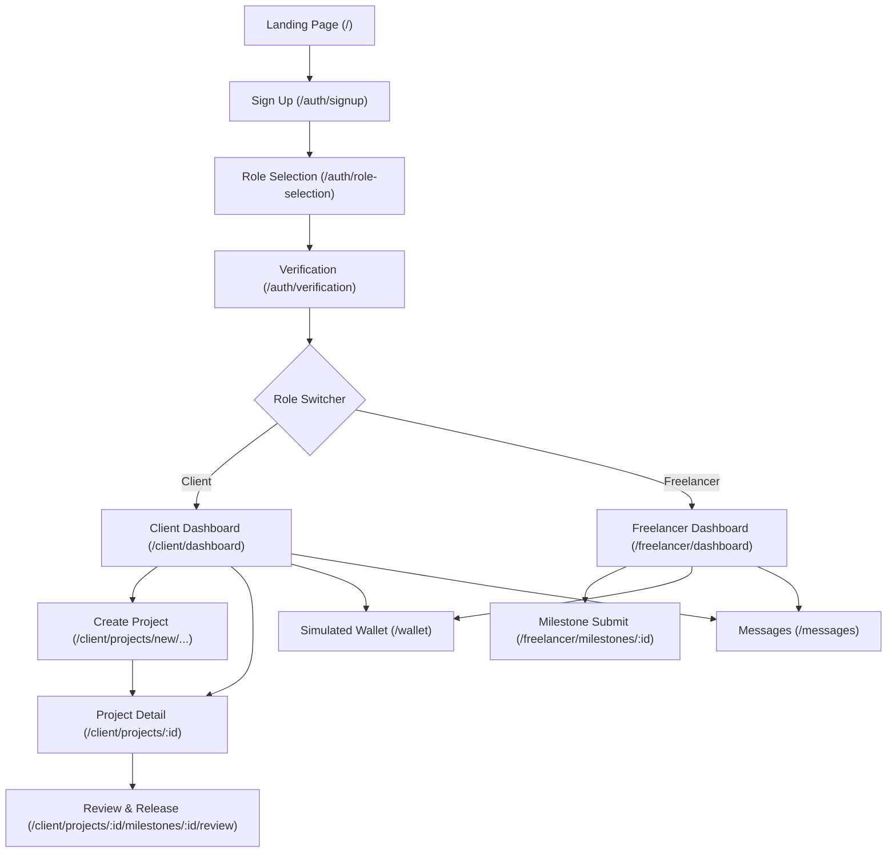

# Information Architecture & Route Mapping

This document maps the application structure, role-based routes, and navigation relationships reverse-engineered from the imported Stitch design.

---

## 1. Application Map (Route Structure)

### Public Routes
* `/` — **Landing Page**: Promotional marketing page with hero block, feature grid panels, and onboarding entrypoints. (Mocked in Screen 9/10).
* `/how-it-works` — **How It Works**: Explains escrow mechanics, milestone releases, and auto-approval countdown rules.
* `/pricing` — **Pricing**: Details on simulated platform fees (escrow fee, payout withdrawal bounds).

### Auth & Onboarding Routes
* `/auth/login` — **Sign In**: Credentials entry and OAuth triggers.
* `/auth/signup` — **Sign Up**: Initial account creation form. (Mocked in Screen 2 - Step 1).
* `/auth/role-selection` — **Choose Role**: Split choice card between "Client" and "Freelancer". (Mocked in Screen 2 - Step 2).
* `/auth/verification` — **KYC Identity Verification**: Simulated Legal name, DOB, and file upload zone with success states. (Mocked in Screen 2 - Step 3 & 4).

### Client Workspace Routes (Alexander Profile)
* `/client/dashboard` — **Client Dashboard**: Alexander's hub showing active project lists, total wallet stakes, and AI alerts. (Mocked in Screen 8).
* `/client/projects/new/details` — **Create Project - Step 1**: Basic details form (Title, Description, Total Budget).
* `/client/projects/new/team` — **Create Project - Step 2**: Invitations and assignee permissions mapping.
* `/client/projects/new/milestones` — **Create Project - Step 3**: Milestone creation forms with AI-assisted generators. (Mocked in Screen 7).
* `/client/projects/:projectId` — **Project Detail**: Details of a selected project showing budgets, team, active steppers, and activities. (Mocked in Screen 4).
* `/client/projects/:projectId/milestones/:milestoneId/review` — **Review & Approval**: Delivery check page with auto-approval countdown, attached files list, staging link, and release triggers. (Mocked in Screen 6).

### Freelancer Workspace Routes
* `/freelancer/dashboard` — **Freelancer Dashboard**: Focus dashboard showing soon due deadlines, total earnings, active milestones, and AI suggestions. (Mocked in Screen 5).
* `/freelancer/milestones/:milestoneId` — **Milestone Detail / Submit**: Work upload forms showing requirements checklist, 72h auto-release alert card, upload drop zone, and success submission states. (Mocked in Screen 11).

### Shared & Workspace Routes
* `/wallet` — **Simulated Wallet & Transaction Ledger**: Financial details showing available balance, locked escrow, release ledgers, and mock deposit/withdrawals. (Mocked in Screen 3).
* `/messages` — **Messages / Chat**: Collaborative channels and context milestone threads.
* `/activity` — **Activity Audit Trail**: Vertical history list of contract transactions.
* `/settings` — **Settings Panel**: Profile edits, security settings, and simulated environment toggles.

---

## 2. Navigation Flow Chart

---

## 3. Navigation Relationships
1. **Onboarding Pipeline**: A strict sequential path from `/auth/signup` to `/auth/verification` before unlocking dashboards.
2. **Review to Release Pipeline**: Clicking "Review Submission" on the Client's Project Detail milestone timeline links directly to `/client/projects/:projectId/milestones/:milestoneId/review`, leading to the Payment Release Modal.
3. **Task Submission Pipeline**: Clicking "Submit Work" on the Freelancer's active milestone card links directly to `/freelancer/milestones/:milestoneId`.
4. **General Navigation**: Left Navigation Sidebar links remain static on dashboard views, allowing one-click access to `/wallet`, `/messages`, and `/settings` at all times.
5. **AI Suggestion Pipeline**: Clicking "Review Details" on the AI assistant creep card redirects users to the project scope audit pane.
