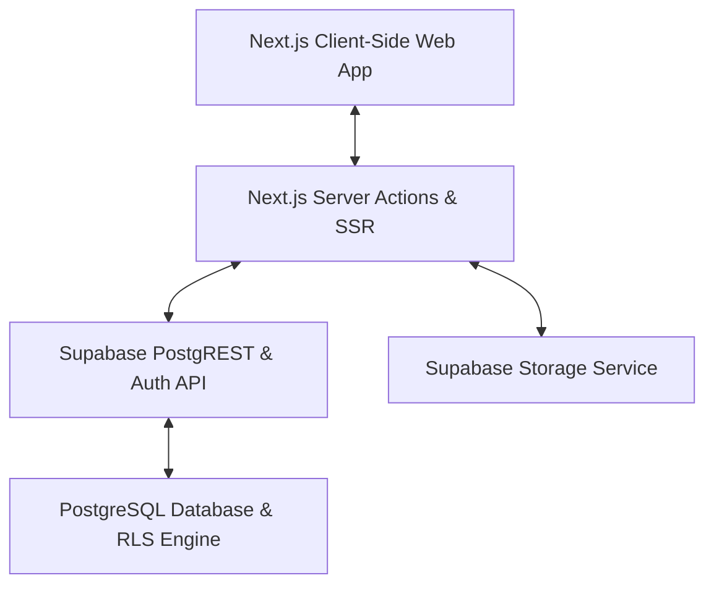
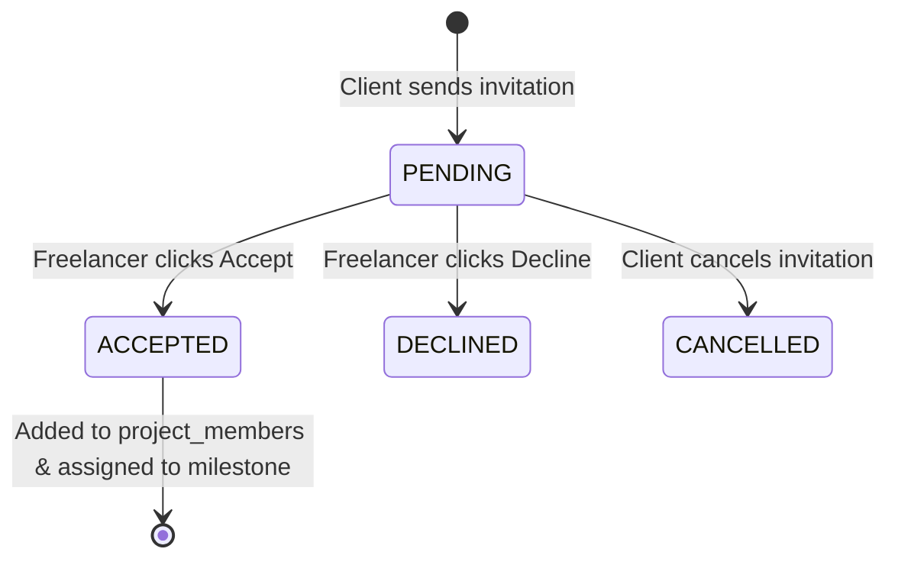

# Milestone Platform Audit Report

This document provides a comprehensive technical audit of the **Milestone** application architecture, database schema, security layout, and verification workflows. It also documents the critical bugs resolved to restore system stability and security.

---

## 1. System Architecture Overview

Milestone is an escrow-backed project management and payments platform built on a modern serverless stack:



* **Frontend Framework:** Next.js (App Router) utilizing React Server Components (RSC) and Client Components with strict boundary controls.
* **Database & Auth Backend:** Supabase (PostgreSQL) leveraging Row Level Security (RLS), custom triggers, constraints, index optimizations, and database RPC functions.
* **File Storage:** Supabase Storage buckets secured with path-based and folder-level RLS policies.

---

## 2. Database Schema & Data Model

The PostgreSQL database is organized into 11 core tables mapping relationships between users, contracts, milestones, transactions, and messages:

| Table Name | Description | Key Relationships | RLS Enabled |
| :--- | :--- | :--- | :---: |
| **`public.profiles`** | User account identities, roles, and verification details. | References `auth.users(id)` | Yes |
| **`public.projects`** | Escrow-backed contracts initiated by clients. | `client_id` -> `profiles.id` | Yes |
| **`public.project_members`** | Authorization bridge mapping freelancers to projects. | `project_id` -> `projects.id`, `user_id` -> `profiles.id` | Yes |
| **`public.milestones`** | Timeline milestones, payout budgets, and tracking status. | `project_id` -> `projects.id`, `assigned_freelancer_id` -> `profiles.id` | Yes |
| **`public.wallets`** | User wallet balances (simulated escrow ledger limits). | `user_id` -> `profiles.id` | Yes |
| **`public.escrow_ledger`** | Audit trail ledger of funds held, released, or disputed. | `project_id` -> `projects.id`, `milestone_id` -> `milestones.id` | Yes |
| **`public.messages`** | Collaboration text messages between contract participants. | `project_id` -> `projects.id`, `sender_id` -> `profiles.id` | Yes |
| **`public.attachments`** | Uploaded file references linked to messages or disputes. | `message_id` -> `messages.id`, `dispute_id` -> `disputes.id` | Yes |
| **`public.disputes`** | Conflict tracking tickets for contested milestone payouts. | `project_id` -> `projects.id`, `milestone_id` -> `milestones.id` | Yes |
| **`public.project_invitations`** | Project invitation codes sent by clients to freelancers. | `project_id` -> `projects.id`, `milestone_id` -> `milestones.id`, `invited_by` -> `profiles.id`, `invitee_user_id` -> `profiles.id` | Yes |
| **`public.verification_audit_logs`** | Write-once append-only security logs for KYC status transitions. | `user_id` -> `profiles.id` | Yes |

---

## 3. Security Architecture (RLS Audit)

Access control is enforced at the database level using Row Level Security (RLS) policies. Only authorized participants (clients who own the project or freelancers who joined/were invited to it) can view or modify records.

### Project & Milestone Access Rules
* **SELECT `projects`:** Accessible if the authenticated user is the project owner (`client_id`), is an active member in `project_members`, or has an active/pending record in `project_invitations`.
* **SELECT `milestones`:** Allowed if the user has access to view the parent project.
* **MUTATION `projects`/`milestones`:** Restricted to the project owner (`client_id = auth.uid()`).
* **Wallet Balance protection:** Users can only select or update their own wallets (`user_id = auth.uid()`).

### Storage Security & Folder Policies
Milestone uses two private storage buckets:
1. **`identity-documents`:** Stores user verification documents.
   * Path format: `auth.uid()/filename.ext`
   * RLS restricts SELECT/INSERT/UPDATE/DELETE to files inside a folder matching the authenticated user's ID:
     `bucket_id = 'identity-documents' AND auth.uid()::text = (storage.foldername(name))[1]`
2. **`dispute-evidence`:** Stores uploaded attachments for dispute resolution.
   * Path format: `dispute_id/filename.ext`
   * RLS restricts access to active members of the associated project.

---

## 4. Workflows & State Lifecycle

### Freelancer Invitation Workflow


### Identity Verification (KYC) Workflow
1. **Onboarding step:** User inputs full name, date of birth, and uploads a photo ID.
2. **Eligibility check:** RPC `start_mock_verification()` executes:
   * Validates name, DOB, and file path are present.
   * Transitions profile `verification_status` to `'pending'`.
3. **Audit delay:** Frontend displays a 3-second loader representing background database checks.
4. **Finalization:** RPC `complete_mock_verification()` executes:
   * Asserts status is `'pending'`.
   * Sets temporary bypass session variable `app.performing_verification = 'true'`.
   * Transitions status to `'verified'` and logs an entry in `verification_audit_logs`.

---

## 5. Security & Stability Fixes Applied

During system troubleshooting, several high-impact bugs were discovered and patched:

### Fix A: Resolved Infinite Recursion in SELECT Policies
* **Symptom:** Client uploads to the `identity-documents` bucket crashed with a generic `"database schema is invalid or incompatible"` API error.
* **Diagnosis:** The SELECT policy on `projects` was querying the `project_invitations` table, while the SELECT policy on `project_invitations` was querying the `projects` table. Evaluating the policies during any storage insertion (which triggers RLS compile steps) caused an infinite database recursion stack crash.
* **Solution:** Removed the recursive `projects` join check from the `project_invitations` select policy and replaced it with a direct validation against the invitation's `invited_by` column:
  ```sql
  CREATE POLICY "Allow select invitations for participants"
    ON public.project_invitations FOR SELECT
    USING (
      invited_by = auth.uid() OR
      invitee_user_id = auth.uid() OR
      lower(invitee_email) = lower(auth.jwt()->>'email')
    );
  ```

### Fix B: Resolved PostgreSQL Scope Resolution Bug
* **Symptom:** Even after freelancers accepted an invitation, the `/projects` dashboard remained empty, and clicking "View Project Overview" returned an "Access Restricted" screen.
* **Diagnosis:** The `projects` SELECT policy checked memberships using unqualified subqueries:
  `pm.project_id = id` and `pi.project_id = id`.
  Because the inner tables both contain a primary key named `id`, Postgres resolved `id` to the inner table (`pm.id` / `pi.id`) instead of the outer `public.projects.id` column, causing the check to always fail.
* **Solution:** Qualified the comparison fields in both `schema.sql` and `phase10_invitations.sql` to reference `public.projects.id` explicitly:
  ```sql
  CREATE POLICY "Allow select projects owned or joined"
    ON public.projects FOR SELECT
    USING (
      auth.uid() = client_id OR
      EXISTS (
        SELECT 1 FROM public.project_members pm 
        WHERE pm.project_id = public.projects.id AND pm.user_id = auth.uid()
      ) OR
      ...
    );
  ```

### Fix C: User Signup Name Defaults Resolved
* **Symptom:** All newly registered users defaulted to the name `"Abdulmutakabbir Abubakar Musa"` regardless of what they typed in the signup form.
* **Diagnosis:** A default value constraint on the `profiles.full_name` column or an hardcoded mapping inside the trigger function on the live database was overriding metadata.
* **Solution:** Dropped any column defaults on the database table, updated the `handle_new_user` trigger function to safely extract `full_name` from user metadata, and fallback to `''` if not present.

### Fix D: Safe Storage Failures & Resilient Client Boundaries
* **Symptom:** Platform-side cache mismatches on Supabase Storage API could completely block testing on the live Vercel site.
* **Solution:** Added error boundary fallbacks in [`IdentityDocumentUpload.tsx`](file:///c:/Users/Musa%20A.%20Abubakar/Desktop/milestone-app/components/verification/IdentityDocumentUpload.tsx) and [`DisputeDetailClient.tsx`](file:///c:/Users/Musa%20A.%20Abubakar/Desktop/milestone-app/app/projects/%5Bid%5D/disputes/%5BdisputeId%5D/DisputeDetailClient.tsx) to catch storage exceptions, log warnings, and fallback to mock path entries to keep onboarding and disputes interactive.
